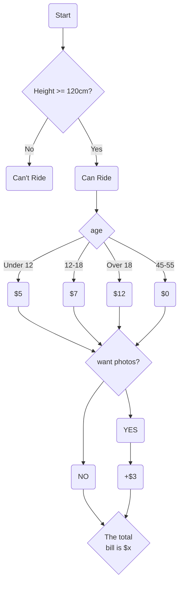
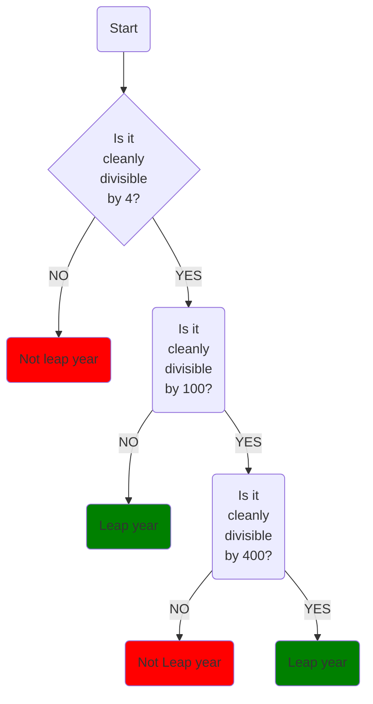
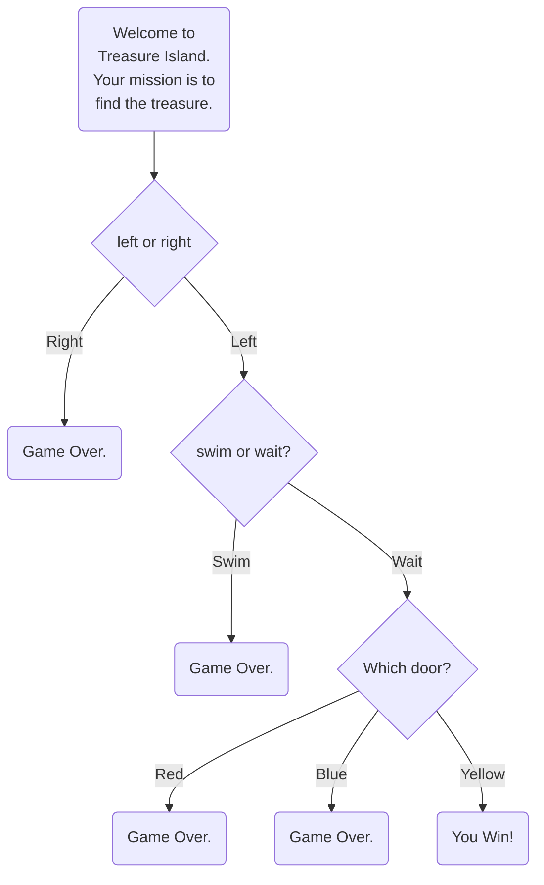

# Day 3 - Control Flow and Logical Operators

# Notes



```python
print("Welcome to the rollercoaster!")
height = int(input("What is your height in cm?"))
price = 0.0

if height >= 120:
	print("You can ride the rolleroaster!")
	age = int(input("What is your age? "))
	if age < 12:
		print("Child tickets are $5.")
		price = 5
	elif age < 18:
		print("Youth tickets are $7.")
		price = 7
	
	elif age>= 45 and age <= 55:
		print("Everything is going to be ok. Have a free ride on us!")

	else:
		print("Adult tickets are $12.")
		price = 12
		
	wants_photo = input("Do you want a photo take? Y or N. ")
	if wants_photo == "Y":
		price += 3
	print(f"Yor total price is {price}")
	
else: 
	print("Sorry you have to grow taller before you can ride.")
```

## Comparison Operators
| **Operator** |       **Meaning**        |
| :----------: | :----------------------: |
|      <       |       Greater than       |
|      >       |        Less than         |
|      >=      | Greater than or equal to |
|      <=      |  Less than or equal to   |
|      ==      |         Equal to         |
|      !=      |       Not equal to       |
|      =       |        Assignment        |

## Logical Operators

```
A and B
C or D
not E
```

# Odd or even
Write a program that works out whether if a given number is an odd or even number.
Even numbers can be divided by 2 with no remainder.
`e.g. 86 is **even** because 86 ÷ 2 = 43`

43 does not have any decimal places. Therefore the division is clean.
`e.g. 59 is **odd** because 59 ÷ 2 = 29.5`

29.5 is not a whole number, it has decimal places. Therefore there is a remainder of 0.5, so the division is not clean.

The **modulo** is written as a percentage sign (%) in Python. It gives you the remainder after a division.

e.g.
`6 ÷ 2 = 3` with no remainder.
therefore: `6 % 2 = 0`

`5 ÷ 2 = 2 x 2 + 1`, remainder is 1.
therefore: `5 % 2 = 1`

`14 ÷ 4 = 3 x 4 + 2`, remainder is 2.
therefore: `14 % 4 = 2`

**Warning** your output should match the Example Output format exactly, even the positions of the commas and full stops.
## Example 1 Input

```
43
```
## Example 1 Output

```
This is an odd number.
```
## Example 2 Input

```
94
```
## Example 2 Output

```
This is an even number.
```

## Solution
```python
number = int(input())

if number % 2 == 0:
  print("This is an even number.")
else:
  print("This is an odd number.")
```

# BMI 2.0
Write a program that interprets the Body Mass Index (BMI) based on a user's weight and height.

It should tell them the interpretation of their BMI based on the BMI value.

- Under 18.5 they are underweight
- Equal to or over 18.5 but below 25 they have a normal weight
- Equal to or over 25 but below 30 they are slightly overweight
- Equal to or over 30 but below 35 they are obese
- Equal to or over 35 they are clinically obese.


The BMI is calculated by dividing a person's weight (in kg) by the square of their height (in m):


The testing code will check for print output that is formatted like one of the lines below:

```
"Your BMI is 18.28678, you are underweight."
"Your BMI is 22.0, you have a normal weight."
"Your BMI is 28.50752, you are slightly overweight."
"Your BMI is 32.56189, you are obese."
"Your BMI is 37.50000, you are clinically obese."
```

## Solution
```python
height = float(input())
weight = int(input())

BMI = weight / height**2

if BMI < 18.5:
  print(f"Your BMI is {BMI}, you are underweight.")
elif BMI <25:
  print(f"Your BMI is {BMI}, you have a normal weight.")
elif BMI <30:
  print(f"Your BMI is {BMI}, you are slightly overweight.")
elif BMI <35:
  print(f"Your BMI is {BMI}, you are obese.")
else:
  print(f"Your BMI is {BMI}, you are clinically obese.")
```

# Leap year
#### 💪 This is a difficult challenge! 💪

Write a program that works out whether if a given year is a leap year. A normal year has 365 days, leap years have 366, with an extra day in February. The reason why we have leap years is really fascinating, [this video](https://www.youtube.com/watch?v=xX96xng7sAE) does it more justice.

This is how you work out whether if a particular year is a leap year.

- on every year that is divisible by 4 with no remainder
- **except** every year that is evenly divisible by 100 with no remainder
- **unless** the year is also divisible by 400 with no remainder

If english is not your first language or if the above logic is confusing, try using this flow chart



e.g. The year 2000:

2000 ÷ 4 = 500 (Leap)
2000 ÷ 100 = 20 (Not Leap)
2000 ÷ 400 = 5 (Leap!)

So the year 2000 is a leap year.

But the year 2100 is not a leap year because:
2100 ÷ 4 = 525 (Leap)
2100 ÷ 100 = 21 (Not Leap)
2100 ÷ 400 = 5.25 (Not Leap)

## Solution
```python
year = int(input())

if year % 4 == 0:
  if year % 100 == 0:
    if year % 400 == 0:
      print("Leap year")
    else:
      print("Not leap year")
  else:
    print("Leap year")
else:
  print("Not leap year")
```

# Pizza Order Practice
Congratulations, you've got a job at Python Pizza! Your first job is to build an automatic pizza order program.

Based on a user's order, work out their final bill.

Small pizza (S): $15
Medium pizza (M): $20
Large pizza (L): $25

Add pepperoni for small pizza (Y or N): +$2
Add pepperoni for medium or large pizza (Y or N): +$3
Add extra cheese for any size pizza (Y or N): +$1

## Solution
```python
print("Thank you for choosing Python Pizza Deliveries!")
size = input() 
add_pepperoni = input() 
extra_cheese = input() 
bill = 0

if size == "S":
  bill += 15
elif size == "M":
  bill += 20
else:
  bill += 25


if add_pepperoni == "Y":
  if size == "S":
    bill += 2
  else:
    bill += 3

if extra_cheese == "Y":
  bill += 1

print(f"Your final bill is: ${bill}.")
```

# Love Calculator
#### 💪 This is a difficult challenge! 💪

You are going to write a program that tests the compatibility between two people.

To work out the love score between two people:

1. Take both people's names and check for the number of times the letters in the word TRUE occurs.
2. Then check for the number of times the letters in the word LOVE occurs.
3. Then combine these numbers to make a 2 digit number.
    
For Love Scores **less than 10** or **greater than 90**, the message should be:

```
"Your score is *x*, you go together like coke and mentos."
```
For Love Scores **between 40 and 50**, the message should be:
```
"Your score is *y*, you are alright together."
```
Otherwise, the message will just be their score. e.g.:
```
"Your score is *z*."
```
e.g.
```
name1 = "Angela Yu"
name2 = "Jack Bauer"
```

T occurs 0 times
R occurs 1 time
U occurs 2 times
E occurs 2 times
Total = 5

L occurs 1 time
O occurs 0 times
V occurs 0 times
E occurs 2 times
Total = 3

Love Score = 53

`Print: "Your score is 53."`

#### These functions will help you:
[lower()](https://www.w3schools.com/python/ref_string_lower.asp) [count()](https://www.w3schools.com/python/ref_list_count.asp)

## Solution
```python
print("The Love Calculator is calculating your score...")
name1 = input()
name2 = input() 
combined_name = str(name1+name2).lower()

T = combined_name.count("t")
R = combined_name.count("r")
U = combined_name.count("u")
E = combined_name.count("e")
L = combined_name.count("l")
O = combined_name.count("o")
V = combined_name.count("v")

first_digit = str(T + R + U + E)
second_digit = str(L + O + V + E)

score = int(first_digit + second_digit)

if score <10 or score >90:
  print(f"Your score is {score}, you go together like coke and mentos.")  
elif score >= 40 and score <= 50:
  print(f"Your score is {score}, you are alright together.") 
else:
  print(f"Your score is {score}.")
```

# Final Project

## Solution
```python
print('''
*******************************************************************************
          |                   |                  |                     |
 _________|________________.=""_;=.______________|_____________________|_______
|                   |  ,-"_,=""     `"=.|                  |
|___________________|__"=._o`"-._        `"=.______________|___________________
          |                `"=._o`"=._      _`"=._                     |
 _________|_____________________:=._o "=._."_.-="'"=.__________________|_______
|                   |    __.--" , ; `"=._o." ,-"""-._ ".   |
|___________________|_._"  ,. .` ` `` ,  `"-._"-._   ". '__|___________________
          |           |o`"=._` , "` `; .". ,  "-._"-._; ;              |
 _________|___________| ;`-.o`"=._; ." ` '`."\` . "-._ /_______________|_______
|                   | |o;    `"-.o`"=._``  '` " ,__.--o;   |
|___________________|_| ;     (#) `-.o `"=.`_.--"_o.-; ;___|___________________
____/______/______/___|o;._    "      `".o|o_.--"    ;o;____/______/______/____
/______/______/______/_"=._o--._        ; | ;        ; ;/______/______/______/_
____/______/______/______/__"=._o--._   ;o|o;     _._;o;____/______/______/____
/______/______/______/______/____"=._o._; | ;_.--"o.--"_/______/______/______/_
____/______/______/______/______/_____"=.o|o_.--""___/______/______/______/____
/______/______/______/______/______/______/______/______/______/______/______
*******************************************************************************
    ''')

print("Welcome to Treasure Island.")
print("Your mission is to find the treasure.") 

print("You're at a cross road. Where do you want to go?")
choice1 = input("Type \"left\" or \"right\" ").lower()
if choice1 == "right":
    print("You fell into a hole. Game Over.")
elif choice1 != "left" and choice1 != "right":
    print("You couldn't spell right. Game Over.")
else:
    print("You've come to a lake. There is an island in the middle of the lake.")
    choice2 = input("Type \"wait\" to wait for a boat. Type \"swim\" to swim across. ").lower()
    if choice2 == "swim":
        print("You became a meal for the sharks. Game Over.")
    elif choice2 != "swim" and  choice2 != "wait":
        print("You couldn't think fast so an assassin shot you. Game Over.")
    else:
        print("You arrive at the island unharmed. There is a house with 3 doors.")
        choice3 = input("One red, one yellow and one blue. Which colour do you choose? " ).lower()
        if choice3 == "red":
            print("The room was filled with fire. You were burned to death. Game Over.")
        elif choice3 == "blue":
            print("The room suddenly filled with water and filled up the room. You drowned. Game Over.")
        elif choice3 == "yellow":
            print("You found an \"X\" mark and begun digging on the center. You found the treasure! You win!")
        else:
            print("The floor below started opening and you fell into a high place. Game Over.")
```
